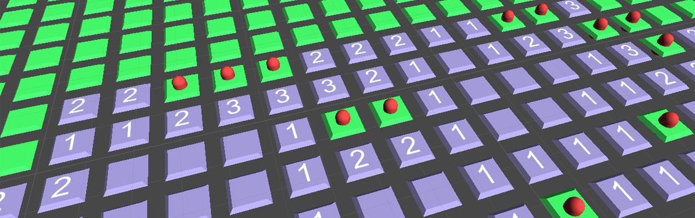

# Minesweeper Unity

      

Implementation of Minesweeper in Unity for the 3-part-article "Build a Grid-Based Puzzle Game Like Minesweeper in Unity" on Tuts+

[Part 1](https://gamedevelopment.tutsplus.com/tutorials/build-a-grid-based-puzzle-game-like-minesweeper-in-unity-setup--cms-21361)
[Part 2](https://gamedevelopment.tutsplus.com/tutorials/build-a-grid-based-puzzle-game-like-minesweeper-in-unity-interaction--cms-21548)
[Part 3](https://gamedevelopment.tutsplus.com/tutorials/build-a-grid-based-puzzle-game-like-minesweeper-in-unity-winning--cms-21591)

Created by Matthias Zarzecki, 2014-06
